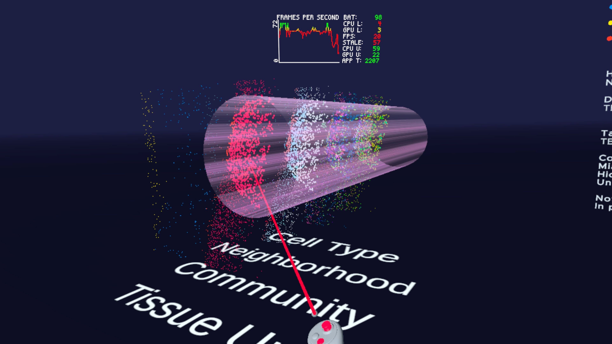

---
---

# Hierarchical Cell Neighborhoods

# Description
Human Large & Small intestine

# Size
Number of cells: 2.6 million

# Source

# Notes
In progress

# Screenshots

# Video

# Acknowledgments
**Courtesy of** Yang Miao and Dr. John Hickey, Duke University