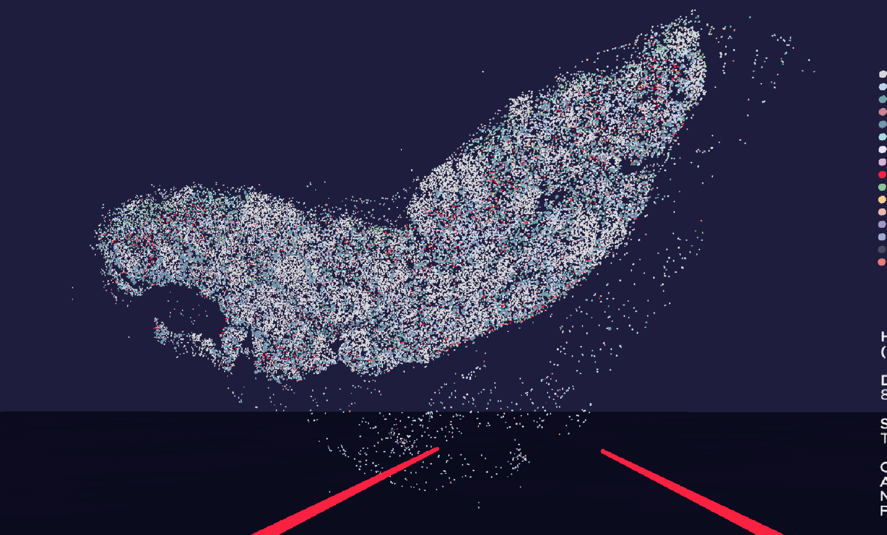

# Human lymph node (CODEX)

# Description
86-year old male lymph nodes

# Size
Number of cells: 2 million 

Thickness: 7µm

Pixel Size: 0.5 µm/px

# Source
SenNet ID TBD, Lab ID LN00837

# Screenshots

# Video

# Acknowledgments
**Courtesy of** Archibald Enninful, Negin Farzad, Rong Fan (TMC Yale)