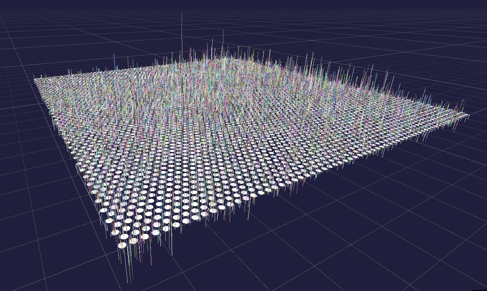

# 8 senescence hallmarks for Visium slide in human, female brain

# Description
Visium-no-probes human dorsolateral prefrontal cortex

Created: Wed Sep 18 2024 16:53:20 GMT-0400 (Eastern Daylight Time)
**Slide information**: There are a total of 4992 total spots per capture area and each spot is 55 µm in diameter with a 100 µm center to center distance between spots.

# Size
**Approx. slide size**:  6.5 x 6.5 mm

# Source
SenNet ID SNT956.RQLW.577

# Notes

# Screenshots

# Video

<iframe width="560" height="315" src="https://www.youtube.com/embed/Wy0BCOFWClk?si=rXWuuQUBVVwNjqVe" title="YouTube video player" frameborder="0" allow="accelerometer; autoplay; clipboard-write; encrypted-media; gyroscope; picture-in-picture; web-share" referrerpolicy="strict-origin-when-cross-origin" allowfullscreen></iframe>

# Acknowledgments
**Courtesy of** Maria Pedersen, Courteney Mattison, Nicholas Sloan, Jason Mares, Hemali Phatnani (NYGC & Columbia University) as well as Vilas Menon (Columbia) and Aidan Daly (NYGC).