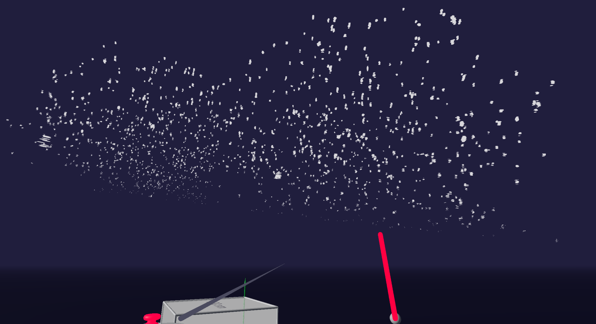

---
---

# Stochastic Optical Reconstruction Microscopy (STORM)

# Description
HeLa Tet-ON Full-Length WT L1 cells

# Size

# Notes
standard HeLa cells which come from a female cervical tumor

**Target**:
ORF1p

**Each dot corresponds to a “blink” of a photoswitchable fluorophore, activating from a dark state to an emissive state. This allows for a more precise and accurate localization of the position of the signal.**

# Screenshots

# Video

# Acknowledgments
**Courtesy of** Chloe Lindberg and Nicola Neretti, Brown University